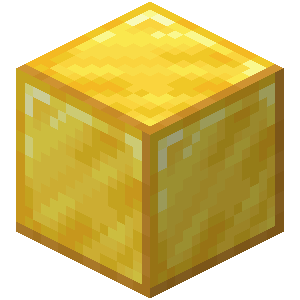

# Overpowered Items

  
  
  
  

# Table of Contents

- [Overview](#overview)
- [Installation](#installation)
- [Features](#features)
	- [Crafting Recipes](#crafting-recipes)

# Overview
Overpowered Items is a minecraft datapack which contains new awsome crafting recipes. Works with minecraft _1.16.3_

# Installation
1. Download latest release from [github.com](https://github.com/kamack38/MinecraftDP-OverpoweredItems/releases).
2. Unpack _.zip_ file using for example [Winrar](https://www.win-rar.com/affdownload/download.php) or [7zip](https://www.7-zip.org/).
3. Place folder in `c:/users/USER/AppData/Roaming/.minecraft/saves/YOURWORLDNAME/datapacks`.
4. Start minecraft and then your minecraft world.
5. Use command `/datapack enable "file/Overpowered Items"` and then `/reload`.
6. After confirmation you can use all datapack features.

  
Confirmation

  </img>

# Features

## Crafting Recipes 

### Weapons

#### Super Sword

| | | |
|-|-|-|
| | </img> | |
| </img> | </img> | </img>
| | </img> | 

#### Super Stick

| | | |
|-|-|-|
| </img> | </img> | </img> |
|</img> | </img> | </img>
</img> | </img> | </img>

### Armour 

#### Crown

| | | |
|-|-|-|
| </img> | </img> | </img> |
|</img> | </img> | </img>
</img> |  | </img>

#### Super Helmet

| | | |
|-|-|-|
| </img> | </img> | </img> |
|</img> |  | </img>
|  |  | 

#### Super Chestplate 

| | | |
|-|-|-|
| </img> |  | </img> |
|</img> | </img> | </img>
</img> | </img> | </img>

#### Super Leggings

| | | |
|-|-|-|
| </img> | </img> | </img> |
|</img> | | </img>
</img> | | </img>

#### Super Boots

| | | |
|-|-|-|
| | </img> | |
|</img> | | </img>
</img> | | </img>

### Pickaxes

#### Sugary Pickaxe

| | | |
|-|-|-|
</img>| </img> | </img>
</img> | </img> | </img>
| | </img> | 

#### Emerald Pickaxe

| | | |
|-|-|-|
</img>| </img> | </img>
| | </img> | 
| | </img> | 

### Decrafting 

#### Acacia Plank

| | | |
|-|-|-|
| | | </img> |
| </img> | </img> | 
| | </img> | 

#### Birch Plank

| | | |
|-|-|-|
| | | </img> |
| </img> | </img> | 
| | </img> | 

#### Dark Oak Plank

| | | |
|-|-|-|
| | | </img> |
| </img> | </img> | 
| | </img> | 

#### Jungle Plank

| | | |
|-|-|-|
| | | </img> |
| </img> | </img> | 
| | </img> | 

#### Oak Plank

| | | |
|-|-|-|
| | | </img> |
| </img> | </img> | 
| | </img> | 

#### Spruce Plank

| | | |
|-|-|-|
| | | </img> |
| </img> | </img> | 
| | </img> | 

### Other

#### Shield

| | | |
|-|-|-|
| | </img>
</img> | </img> | </img>
| | </img> |

#### Enchanted TNT 

| | | |
|-|-|-|
</img>| </img> | </img>
</img> | </img> | </img>
</img> | </img> | </img>

#### Enchanted Diamond Block

| | | |
|-|-|-|
</img>| </img> | </img>
</img> | </img> | </img>
</img> | </img> | </img>